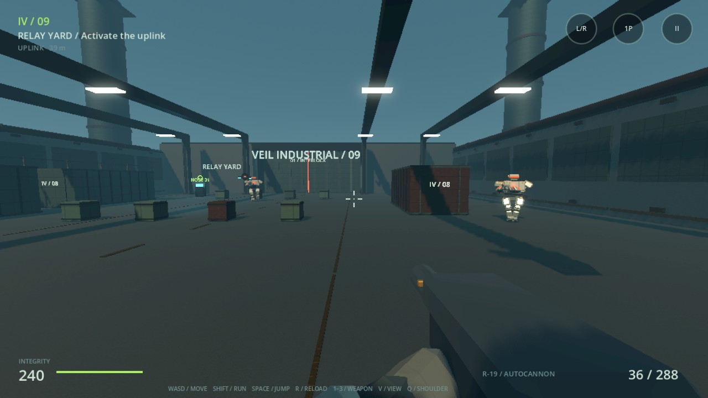
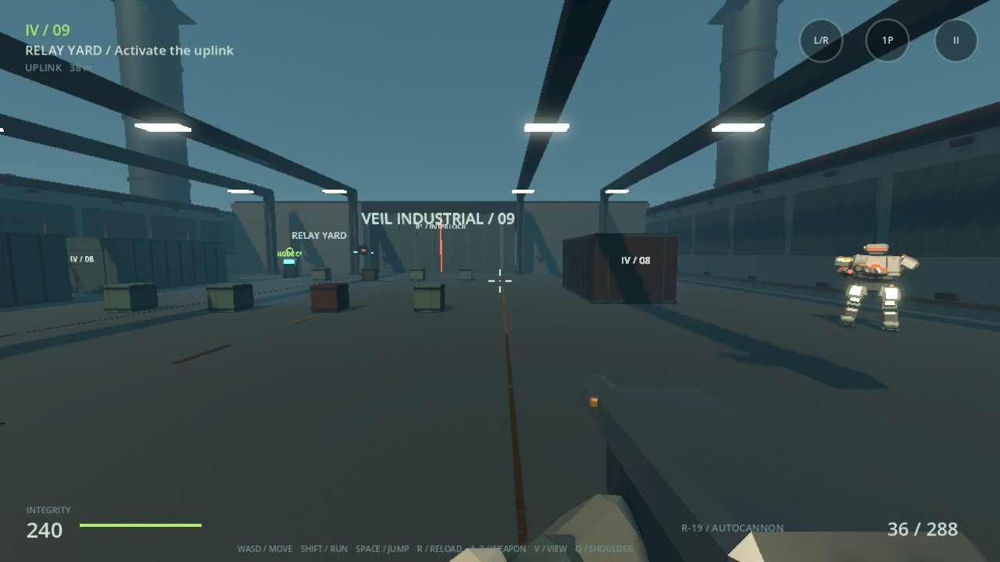

# IRON//VEIL

Original offline Android robot combat game. A heavy Wraith android infiltrates
an abandoned industrial facility, breaks three interlocks and defeats its
autonomous Warden before transmitting an extraction signal.

Godot **4.6.2**, GDScript, **Vulkan Mobile**, engine physics. MIT.
Android 7.0 / API 24 minimum; a modern Vulkan-capable device is recommended.
The packaged APK supports arm64 and x86_64. Landscape, fully offline, no account.





## Play

Install the APK from Releases or the successful Android validation workflow.
The development APK is signed with a debug certificate. It is installable;
it is not a Google Play submission. Uninstall an older differently signed test
build if Android rejects an update. No development server is required.

Deploy from the main menu. Follow the lime uplink marker through Relay Yard,
Coolant Control and Core Hall. Activate each terminal at close range. The last
terminal unlocks after the Warden and its escorts are destroyed. Terminals save
checkpoints, restore some integrity and provide ammunition.

## Implemented

- Shared first-person / third-person robot state. Smooth perspective switching,
  shoulder switching, sphere-swept camera collision, configurable FOV and distance.
- Original articulated Wraith mesh: armor, joints, copper hydraulics, feet,
  emissive visor and mounted weapon. Procedural locomotion, planted stance feet,
  terrain probes, aiming, firing, reload, landing and mechanical disassembly.
- Acceleration, sprint, jump, gravity, slopes, real stairs and a maintenance catwalk.
- R-19 autocannon, K-6 nine-pellet breacher, V-3 charged coil lance. Different
  cadence, spread, recoil, magazine, reload, charging and armor interaction.
- Camera target selection followed by a separate muzzle ray. A nearby wall
  blocks the shot even if the shoulder camera can see a target.
- Scout drone, combat android, armored heavy and enhanced Warden. Visibility,
  patrol/search memory, A* pursuit, strafing, distance management, stagger,
  telegraphed heavy projectiles and sensor/arm/leg failures.
- Animated localized ray hitboxes, readable subsystem damage, hit feedback,
  sparks, concrete/metal impacts, physical cargo, explosive crates and debris.
- Three connected industrial zones: containers, machinery, pipes, beams, stairs,
  ramps, warning signage, steam, suspended reactor and exterior structures.
- PBR materials, original wear/normal textures, directional shadows, fog,
  emissive machinery, local lights and transient muzzle illumination.
- Independent multi-touch movement/look/fire, optional gyro, gamepad and desktop
  inputs. Minimal HUD, menus, checkpoints, settings and focus-loss pause.

## Controls

| Action | Touch | Desktop | Gamepad |
|---|---|---|---|
| Move / look | Left stick / right region | WASD / mouse | Left / right stick |
| Fire / ADS | FIRE / ADS | LMB / RMB | RT / LT |
| Sprint | RUN toggle | Shift | Left stick click |
| Jump / reload | JUMP / R | Space / R | A / X |
| Weapon | Weapon button | 1–3 or wheel | Y |
| Perspective / shoulder | 3P–1P / L–R | V / Q | RB / LB |
| Terminal | E near uplink | E | B |
| Pause / resume | II / Resume | Escape | Start |

Touch look remains available while another finger fires or moves. Gyro can be
enabled globally or only during ADS. Sensitivity, vertical inversion, touch size,
audio and shake are persisted. Mobile HUD respects the reported display safe area.

## Graphics

| Preset | Render scale | Shadows | MSAA | Effects |
|---|---:|---:|---:|---|
| Low | 55% | Off | Off | Small budget |
| Medium | 70% | 38 m | 2x | Moderate |
| High | 85% | 70 m | 2x | High |
| Ultra / experimental | 100% | 100 m | 4x | Maximum |

Options can be changed independently. Low disables localized environmental
lights and steam. Optional dynamic render scale adjusts within 50%–the configured
maximum without changing AI or physics. FPS limits: 30 / 60 / 90 / 120.
Performance overlay: settings or F3. See [performance notes](docs/PERFORMANCE.md).

## Build and test

Install Godot 4.6.2, its Android export templates, JDK 17 and Android SDK build
tools. CI pins the Godot executable by SHA-256. On Linux with an Android SDK:

```bash
bash tools/setup_godot.sh
.ci-tools/godot/godot --headless --editor --import
.ci-tools/godot/godot --headless res://tests/unit.tscn
.ci-tools/godot/godot --headless -- --integration
.ci-tools/godot/godot --headless --export-debug Android build/IRON_VEIL_0.1.0.apk
```

The art is checked in. Regenerate it with Python 3 and `numpy`, `Pillow`, `scipy`:

```bash
python3 tools/make_assets.py
```

Desktop render validation / reproducible four-scenario benchmark:

```bash
godot --audio-driver Dummy -- --capture
godot --audio-driver Dummy -- --benchmark
```

These development switches write actual viewport captures and JSON measurements.
Benchmark combat adds eight enemies; the player is invulnerable during measurement.
Two seconds of warm-up precede each seven-second sample window.

CI compiles resources, runs unit/integration tests, renders the benchmark,
exports/verifies the APK and installs it into an Android API 35 emulator. The
emulator exercises launch, touch movement, view switching and background/resume.

## Structure

`scripts/`: game flow, robot, camera/controller, weapons, AI, damage zones,
facility builder, effects, spatial sound, HUD and settings.
`assets/`: original glTF meshes, PBR textures, WAV sounds and engine notices.
`shaders/`: vertex-colored armor material.
`tools/`: asset generator and build/Android validation scripts.
`tests/`: meaningful logic and full-scene runtime checks.

## Limits

This is one complete vertical-slice mission with procedural industrial art,
not Frontiers-equivalent AAA production. There is no full campaign, online mode,
authored cinematic animation, baked GI, volumetric lighting or comprehensive
environmental destruction. Death uses mechanical disassembly instead of a
skeletal ragdoll. Humanoid navigation plans on the main floor; catwalks are
player-accessible, but AI does not plan multi-level traversal. Cover response is
repositioning/obstacle avoidance, not a cover reservation system.

Nothing Phone (3) performance, physical-device gyro behavior, prolonged thermal
stability and actual gamepad ergonomics remain to be measured. The included
software-rendered desktop numbers are not Android hardware FPS claims. The APK
is a test distribution; an AAB and owner-controlled production signing are not
included.

## Attribution

All game assets and code are original, MIT. No Frontiers content is copied.
[Asset provenance](docs/ASSETS.md); bundled engine MIT and third-party notices
are in `assets/GODOT_LICENSE.txt` and `assets/GODOT_COPYRIGHT.txt` and ship in the
APK. Build tooling dependencies are not shipped as gameplay dependencies.
